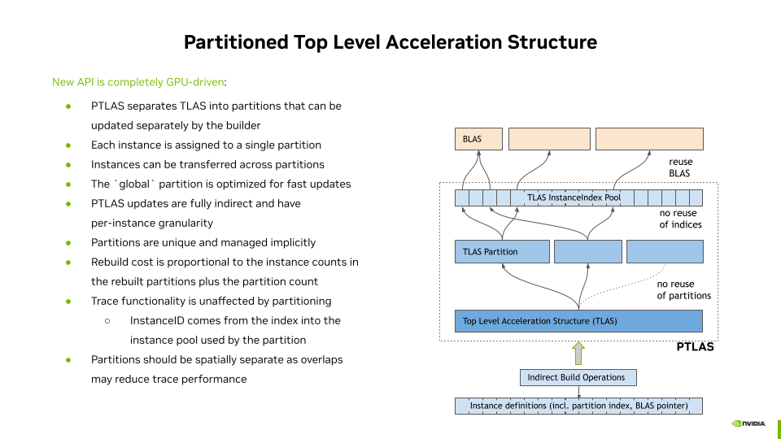
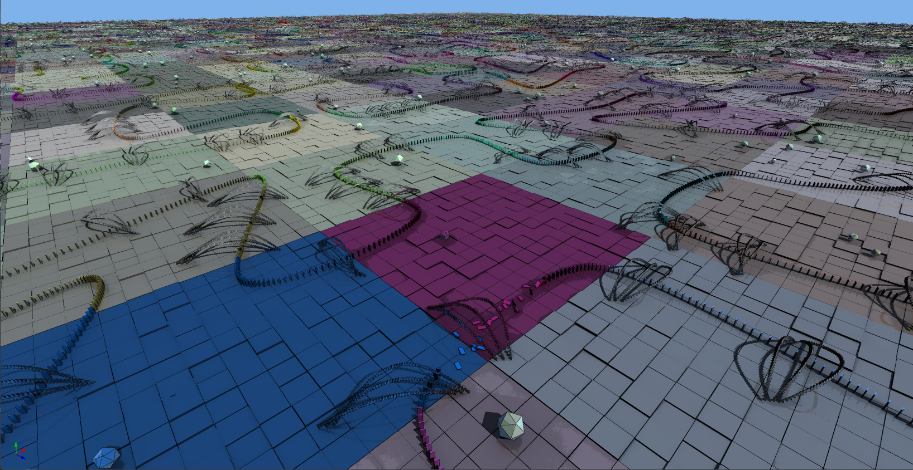

# vk_partitioned_tlas

This sample illustrates partial TLAS updates using the `VK_NV_partitioned_tlas` extension. 



The app procedurally lays out 1.9 million dominoes on a board made of 11 million static objects, where dominoes board objects are assigned to partitions defined by a uniform 2D grid. Upon running the (wildly inaccurate) physics simulation, only the currently moving instances are updated in the partitioned acceleration structure (PTLAS). The corresponding partitions are highlighed by saturated colors on the ground plane. The domino colors illustrate which partition they are part of. The color of the partitions are random for illustration purposes.



The update behavior of the PTLAS is defined in the "Partition update mode" section of the UI:
- Always update partition: when the transform of a domino is updated, the related instance is rewritten within its partition. The actual partition definition stays the same. Internally the partition will be updated to reflect the change in the modified domino. While this approach yields the best trace performance, this update may be costly depending on the number of instances in the partition.
- Always mode dynamic to global: the PTLAS introduces a "global partition" that can be used for fast updates of dynamic objects at the expense of trace performance. In this mode, when a domino starts toppling it is removed from its original partition and reassigned to the global partition. It will then remain in the global partition until its dynamics stabilize, after which it will be moved back in its original partition. This mode is noticeably faster than the systematic partition update, but may result in a slight loss of trace performance.
- Update partition nearby, move to global otherwise: this mode attempts at merging the benefits of both above approaches. If the center of the partition is closer to the viewpoint than the threshold "Mode change distance" we consider the partitions has a large screen coverage and favor the trace performance by updating the original partitions. For the (more numerous) farther partitions we move toppling dominoes into the global partition for increased update performance.

The checkbox "Mark all dominoes dynamic in partition" is active if the current update mode involves the global partition. When checked the entire set of dominoes of a partition are moved to the global partition as soon as one of them topples. This reduces the amount of partition updates, but may move an excessive amount of dominoes in the global partition.

Usage:
- Camera movement: by default the mouse is used to look around, and WASD keys for motion. Other camera movement modes (orbit, walk) can be chosen from the Camera section. 
- The physics simulation can be started using the Play button, which will automatically topple a number of dominoes. Specific dominoes can be toppled using a mouse right-click. The animation is reset using the Stop button. 
- The size of the domino board and the number of partitions can be dynamically changed. The new values are taken into account after clicking on the "Regenerate scene" button.

Notes:
- The domino generation uses STL and is not entirely multithreaded. It may become slow when generating large boards with Debug builds.
- The current driver version requires clusters (VK_NV_cluster_acceleration_structure) to be requested when compiling the raytracing pipelines. While the extension itself may not be active at the instance level, it has to be requested in the pNext member of `VkRayTracingPipelineCreateInfoKHR`.

## Files

### C++ Files
- `partitioned_tlas_acceleration_structures.hpp` Helper functions for PTLAS creation
- `partitioned_tlas.hpp` Definition of the app class
- `partitioned_tlas.cpp` Main app setup and render function
- `partitioned_tlas_acceleration_structure.cpp` Build functions for BLAS, TLAS and PTLAS
- `partitioned_tlas_pipelines.cpp` Creation of raytracing and compute pipelines
- `partitioned_tlas_scene.cpp` Scene creation and domino layout
- `partitioned_tlas_ui.cpp` User interface
- `vk_NV_partitioned_acc.h/cpp` Definition of the `VK_NV_partitioned_tlas` extension

### Shader Files
- `animation_init.comp.glsl` Initialization of the data structure for physics simulation and of the PTLAS structures if needed
- `animation_physics.comp.glsl` Physics simulation, mark dominoes and partitions for updates, and update the regular TLAS instances (only if TLAS is enabled)
- `animation_update_instances.comp.glsl` Rewrite the toppling PTLAS instances, and rewrite the per-instance partition indices if needed to move dominoes to/from the global partition
- `compositing.comp.glsl` Simplistic AO denoising and toon shading
- `device_host.h` Definition of the structures used in both host and device code
- `dh_bindings.h` Definition of the shader binding indices, used in both host and device code
- `gl_NV_partitioned_acc.h` GLSL counterpart of the structures defined in the `VK_NV_partitioned_tlas` extension, used when preparing the PTLAS update buffers in `animation.comp.glsl`
- `payload.h` Definition of the ray payload
- `raytrace.rchit.glsl` Closest-hit ray tracing shader, uses simplistic recursive ray tracing. Also contains code for domino topple triggers and partition highights
- `raytrace.rgen.glsl` Ray generation shader
- `raytrace.rmiss.glsl` Ray miss shader using a procedural sun and sky model

## TLAS vs. PTLAS

From a shader perspective TLAS and PTLAS are referenced identically as an `accelerationStructureEXT` in the ray generation and closest hit shaders. The geometry itself is defined in regular BLAS'es regardless of the top-level acceleration structure type. The construction code for TLAS and PTLAS, however, follow different principles. 

The acceleration structure building code is defined in `partitioned_tlas_acceleration_structure.cpp`. The regular TLAS is built in the `createTopLevelAS` function. The instances themselves are provided in a device-side buffer, and the build information such as the number of instances, flags etc. are defined on host side. In order to call the `vkCmdBuildAccelerationStructuresKHR` function the build information has to be known on the host at the moment of the call. The build will then update the entire TLAS using the contents of the instances buffer. 

The partitioned TLAS build code is defined in `createPartitionedTopLevelAS`, using helper functions from `partitioned_acceleration_structures.hpp`. In contrast with the regular TLAS, all calls are indirect, meaning no build information has to be synchronized on the host in order to trigger an acceleration structure build or update. The remainder of this section will focus on the contents of the helper functions, which directly use the `VK_NV_partitioned_tlas` extension.

In a way similar to the TLAS, we first need to estimate how much memory will be required to generate and store the resulting PTLAS. The `vkGetPartitionedAccelerationStructuresBuildSizesNV` takes in particular the total number of instances and partitions, and the maximum number of instances any single partition may hold. The helper function `PartitionedAccelerationStructures::getBuildSizes` also takes additional information such as the maximum number of PTLAS update operations that may be performed simultaneously, and whether instances and partitions may be updated (more details on those below). From this information the helper struct `PartitionedAccelerationStructures::BuildSizeInfo` will contain the sizes of all the buffers required to generate and store the PTLAS, along with the sizes of the buffers containing the instance, partition and build operation definitions. The application is then responsible for allocating those buffers and providing a helper structure `PartitionedAccelerationStructures::Buffers` to the builder class. 

### Initial Build

After initializing the scene the application sets up the instance and partition data on the host, and calls `PartitionedAccelerationStructures::uploadPtlasData` that will write all relevant data into the corresponding device buffers.

A PTLAS instance is defined by a `VkPartitionedAccelerationStructureWriteInstanceDataNV` structure, which is very similar to `VkAccelerationStructureInstanceKHR`:

```
struct VkAccelerationStructureInstanceKHR {
    VkTransformMatrixKHR          transform;
    uint32_t                      instanceCustomIndex:24;
    uint32_t                      mask:8;
    uint32_t                      instanceShaderBindingTableRecordOffset:24;
    VkGeometryInstanceFlagsKHR    flags:8;
    uint64_t                      accelerationStructureReference;
}
```

```
struct VkPartitionedAccelerationStructureWriteInstanceDataNV
{
  VkTransformMatrixKHR                               transform;
  float                                              explicitAABB[6];
  uint32_t                                           instanceID;
  uint32_t                                           instanceMask;
  uint32_t                                           instanceContributionToHitGroupIndex;
  VkPartitionedAccelerationStructureInstanceFlagsNV instanceFlags;
  uint32_t                                           instanceIndex;
  uint32_t                                           partitionIndex;
  VkDeviceAddress                                    accelerationStructure;
};
```
A key difference is the `instanceIndex` member, that specifies the index of the instance so it may be referenced by a partition. Please note the buffer of `VkPartitionedAccelerationStructureWriteInstanceDataNV` *must not* contain duplicate `instanceIndex` (undefined behavior otherwise).

Optionally a translation vector per partitions can be defined using the `VkPartitionedAccelerationStructureWritePartitionDataNV` structure so all instances within the partition will be additionally translated by that vector:
```
struct VkPartitionedAccelerationStructureWritePartitionDataNV
{
  uint32_t        partitionIndex;
  float           partitionTranslation[3];
}
```
A buffer of `VkPartitionedAccelerationStructureWritePartitionDataNV` *must not* contain duplicate `partitionIndex` (undefined behavior otherwise). Such a buffer is *only* necessary if per-partition translation is enabled.

Once the instance data is uploaded, a regular TLAS only requires a call to `vkCmdBuildAccelerationStructuresKHR` with the appropriate instance counts etc. The PTLAS build calls are indirect and may apply to an arbitrary number of instances and partitions, hence all information must be available on device side to avoid synchronization. For this, build and update operations are defined in `VkBuildPartitionedAccelerationStructureIndirectCommandNV` structures, that will be uploaded on the device prior to the actual build. This structure defines the operation type, the number of arguments to the operation, and the address of the arguments:
```
struct VkBuildPartitionedAccelerationStructureIndirectCommandNV
{
  VkPartitionedAccelerationStructureOpTypeNV opType;
  uint32_t                                    argCount;
  VkStridedDeviceAddressNV                   argData;
}
```
Since we do not use per-partition translation we only write the instance definitions, and hence use 1 `VkBuildPartitionedAccelerationStructureIndirectCommandNV` with `opType == VK_PARTITIONED_ACCELERATION_STRUCTURE_OP_TYPE_WRITE_INSTANCE_NV`. 

The instance write operation has as many arguments as instances, and its argument address is the buffer containing the `VkPartitionedAccelerationStructureWriteInstanceDataNV` structures on the device. And additional buffer contains the number of operations, 1 in this case. 

The actual PTLAS build function `vkCmdBuildPartitionedAccelerationStructuresNV` then only depends on device-side addresses provided in `VkBuildPartitionedAccelerationStructureInfoNV`:
```
struct VkBuildPartitionedAccelerationStructureInfoNV
{
  VkStructureType                                     sType;
  void*                                               pNext;
  VkPartitionedAccelerationStructureInstancesInputNV input;
  VkDeviceAddress                                     srcAccelerationStructureData;
  VkDeviceAddress                                     dstAccelerationStructureData;
  VkDeviceAddress                                     scratchData;
  VkDeviceAddress                                     srcInfos;
  VkDeviceAddress                                     srcInfosCount;
}
```

Binding a PTLAS to a pipeline requires adding a `VkWriteDescriptorSetPartitionedAccelerationStructureNV` to the `pNext` chain of the  `VkWriteDescriptorSet`. For convenience the helper function `PartitionedAccelerationStructures::getWriteDescriptorSet` returns a `VkWriteDescriptorSet` of type `VK_DESCRIPTOR_TYPE_PARTITIONED_ACCELERATION_STRUCTURE_NV` with the appropriate `pNext` pointer.

### Dynamic Updates

With a regular TLAS the contents of the instance buffer can be dynamically modified, and `vkCmdBuildAccelerationStructuresKHR` rebuilds/refits the entire TLAS by reading this entire buffer. The PTLAS allows the application to provide partial changes, eg. changing the matrices of just a few instances. 

In this sample the animation shader `animation_physics.comp.glsl` updates the transform matrices of the dominoes and requests moves to and from the global partition depending on the user-selected update mode. This shader also updates the timestamp of the partitions where dominoes are currently toppling. If a domino needs to be moved to the global partition or back into its original partition, the shader requests the partition change for it (and marks both partitions so they can be highlighted in the final rendering).

When PTLAS are active the `animation_update_instances.comp.glsl` shader has access to a buffer of `VkPartitionedAccelerationStructureWriteInstanceDataNV` as well as the buffer of `VkBuildPartitionedAccelerationStructureIndirectCommandNV` defining the operations to perform on the PTLAS. For each domino that topples or changes partition the `argCount` of the instance write operation will be atomically incremented. The value of `argCount` before the increment provides the index at which the shader will write the instance definition. The order of the atomic calls is unspecified, which highlights a feature of the PTLAS: the new instances transforms do not have to have consecutive indices, nor to be grouped by partition. The only requirement is each instance only appears once in the buffer.

On the host side, `vkCmdBuildPartitionedAccelerationStructuresNV` is called systematically after each animation step. The builder will then lazily update the PTLAS. This is visible in the embedded Profiler window, where the PTLAS update time varies depending on the number of actually updated dominoes and partitions. In contrast, the PTLAS update time is stable (albeit higher) regarless of the number of dynamic objects.
